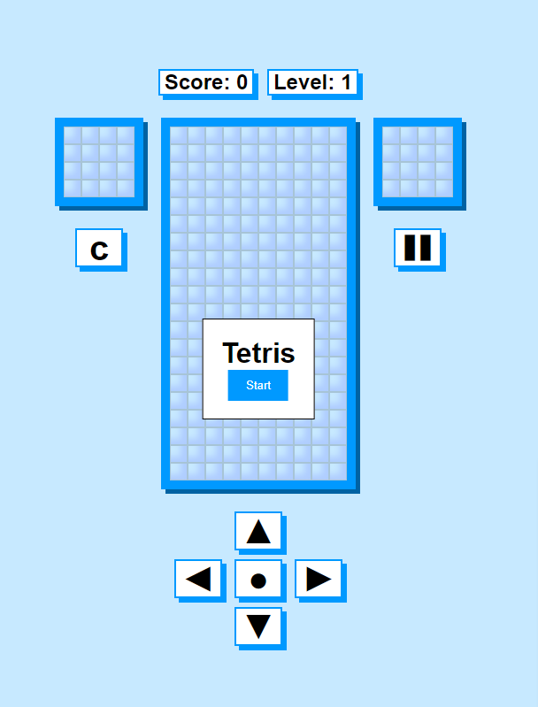

  

# Javascript Tetris Game

This project is a Tetris game developed with JavaScript without using any libraries. You can play the game by clicking [here](https://github.com/Abdullah-Yilmazer/Javascript-Tetris-Game).

## Overview

This project allows you to play the classic Tetris game in your browser. It is developed using HTML, CSS, and JavaScript without any external libraries. The objective of the game is to arrange the blocks neatly and fill the lines.

## Usage

To start the game, simply open the `index.html` file in your browser. Once the game is loaded, you can move and rotate the blocks using the arrow keys and other specified keys on your keyboard.

## Key Bindings

The key bindings for the game are as follows:

- Left Arrow: Moves the block to the left.
- Up Arrow: Rotates the block.
- Right Arrow: Moves the block to the right.
- Down Arrow: Moves the block down.
- Space: Drops the block quickly and places it.
- C: Saves the block.

## Demo

You can see a live demo of the application [here](https://abdullah-yilmazer.github.io/Javascript-Tetris-Game).

## Contributing

Contributions are welcome! If you have any ideas for improvements or new features, feel free to open an issue or submit a pull request.

## License

This project is licensed under the [MIT License](https://github.com/Abdullah-Yilmazer/Javascript-Tetris-Game/blob/main/LICENSE).
